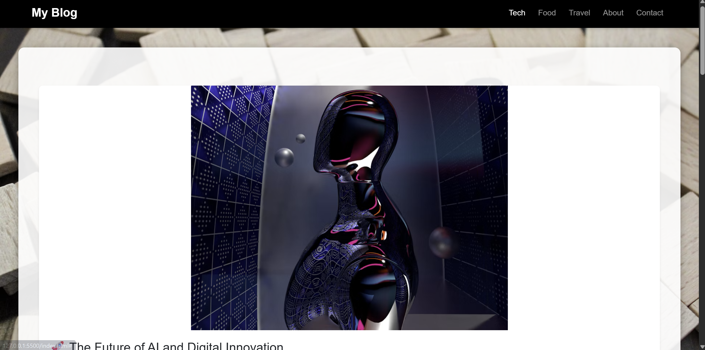

# My Blog Website

## Overview
A responsive and interactive blog website built using **HTML, CSS, and JavaScript**.  
This website features multiple blog posts, a comment system, search functionality for enhanced user experience.  

---

## Features
- Responsive design for mobile and desktop screens  
- Three blog posts with images, titles, content, and publication date  
- Comment section for each blog post (stored locally using `localStorage`)  
- Navigation menu for easy browsing between pages  
- Contact and About pages  
- Smooth design with Bootstrap and custom CSS  

---

## Technologies Used
- **HTML5** for structure  
- **CSS3** for styling and layout  
- **JavaScript** for interactivity (comments, , search)  
- **Bootstrap 5** for responsive design  
- **Font Awesome** for icons  
- **Google Fonts** for typography  

---

## Pages
- `index.html` – Main blog page with posts and comments  
- `about.html` – About section with personal info and blog mission  
- `contact.html` – Contact form (frontend only, no backend)  

---

## Live Demo
Check the website live here:  

---

## Screenshot
  

---

## How to Run Locally
1. Clone or download the repository  
2. Open `index.html` in your browser  
3. Start exploring the blog posts and features  

---

## Author
**Tufail Hasan**  
Email: tufaildafedar0@gmail.com 
LinkedIn: www.linkedin.com/in/tufailhasan3241  
GitHub: https://github.com/tufaildafedar0-prog

---

**Note:** This is a frontend-only project. Comments are stored in browser `localStorage` and contact form does not have backend integration.

